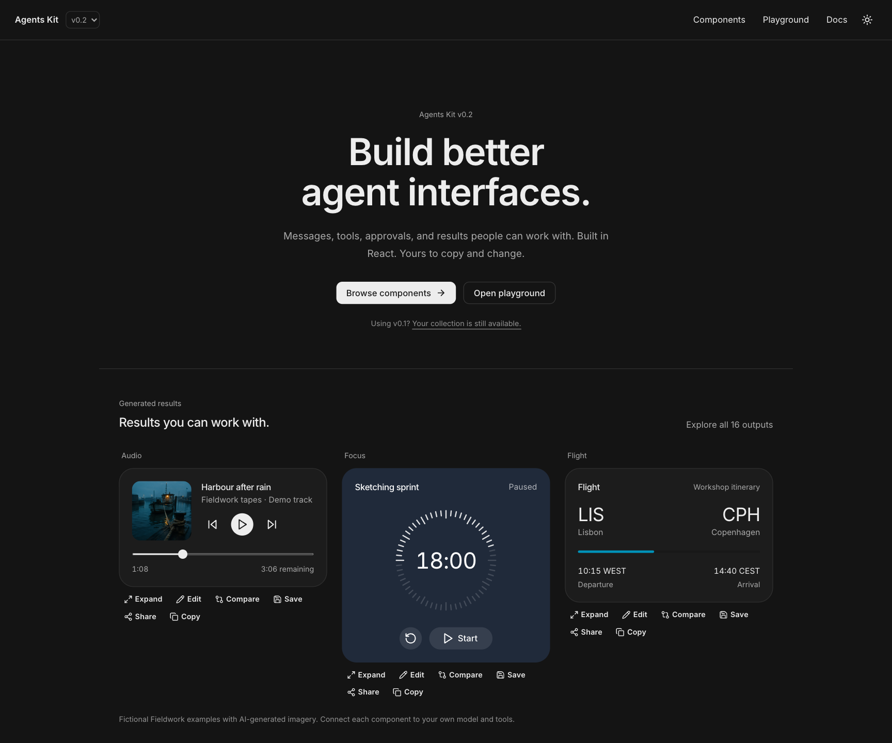
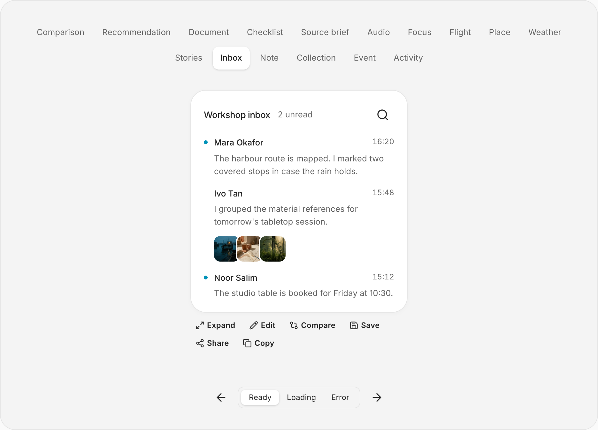
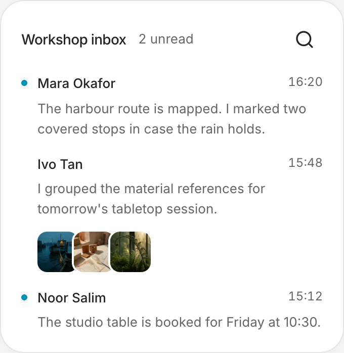
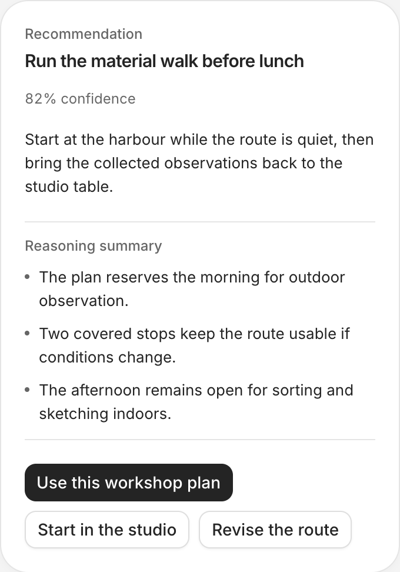
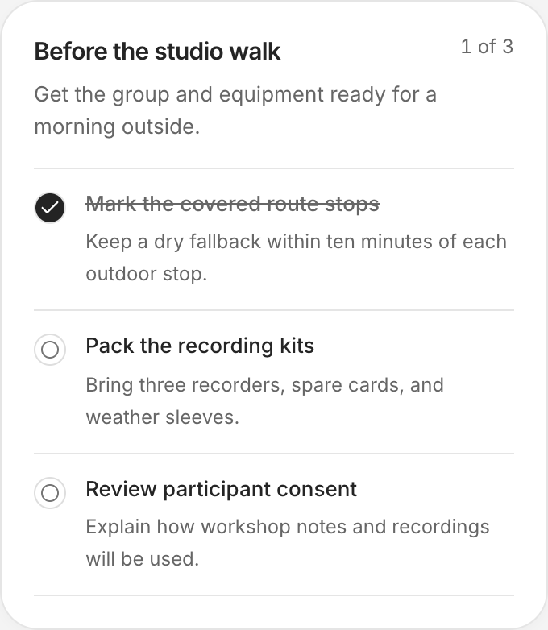

# Agents Kit

[](https://agents-ui.github.io/agents-kit/)

Agents Kit is a copy-source React library for generative interfaces and AI agent products. Version 0.2 focuses the main catalog on reusable answer surfaces, reasoning states, approvals, tools, tasks, messages, citations, code, generated media, and complete agent workspaces.

Version 0.2 adds the new collection while keeping the public v0.1 component paths and registry slugs available. The previous public source is preserved in the [v0.1.0 tag](https://github.com/agents-ui/agents-kit/tree/v0.1.0).

[Live site](https://agents-ui.github.io/agents-kit/) · [Components](https://agents-ui.github.io/agents-kit/components) · [Playground](https://agents-ui.github.io/agents-kit/generative) · [v0.1 archive](https://agents-ui.github.io/agents-kit/v0.1)

[Installation](https://agents-ui.github.io/agents-kit/docs/installation) · [MCP setup](https://agents-ui.github.io/agents-kit/docs/mcp) · [llms.txt](https://agents-ui.github.io/agents-kit/llms.txt) · [Full LLM reference](https://agents-ui.github.io/agents-kit/llms-full.txt)

## Why v0.2

Agent interfaces are moving beyond fixed dashboards. Models now return structured answers, stream tool work, expose context limits, pause for approval, and produce artifacts that users refine. Version 0.2 reorganizes Agents Kit around those interactions. The previous role-specific components remain available for compatibility, while new work starts from smaller generative UI families that can be composed around any model or backend.

## Explore

- `/components` presents the v0.2 component families in one continuous, searchable catalog.
- `/generative` shows generated answers and work products in ready, loading, and error states.
- `/v0.1` keeps the previous component gallery available for existing users.
- `/docs` explains installation, integration, provenance, and the v0.2 migration.

## What v0.2 adds

| Collection       | Included in v0.2                                                                                   |
| ---------------- | -------------------------------------------------------------------------------------------------- |
| Beautiful UI     | All 21 public component families, reauthored as controlled React components                        |
| beUI AI Agents   | All 17 public AI agent families, distributed through 19 installable registry slugs                 |
| Generative UI    | 11 answer shapes and five work-output shapes in one controlled surface system                      |
| Thinking Orb     | All nine public canvas states with light, dark, paused, and reduced-motion behavior                |
| Agent runtime    | Context usage and checkpoint controls informed by public AI Elements patterns                      |
| Blocks.so        | Four controlled compositions for a workspace composer, file queue, setup checklist, and task table |
| Optional effects | Border Beam and Gooey for active borders, shape changes, and moving indicators                     |

The main catalog groups equivalent implementations into families. For example, related loading, approval, prompt, message, code, and task components appear together as source variants instead of repeated, unrelated entries.

## Generative UI

[](https://agents-ui.github.io/agents-kit/generative)

Try an inbox, compare two options, review a document, or update a checklist. Expand a result, edit its content, compare versions, save it, or share a link from the playground.

The examples follow Fieldwork, a fictional studio planning a Lisbon–Copenhagen workshop. Names, messages, itineraries, and figures are illustrative. The harbour, studio, and botanical artwork was generated for these demos; screenshots show the actual components.

### A closer look

<table>
  <tr>
    <td width="50%" valign="top">
      <strong>An inbox that brings the work together</strong><br />
      Updates, attachments, unread states, and the next action.<br /><br />
      <a href="https://agents-ui.github.io/agents-kit/generative#generated-inbox"></a>
    </td>
    <td width="50%" valign="top">
      <strong>Collections worth opening</strong><br />
      Images grouped into a compact, editable result.<br /><br />
      <a href="https://agents-ui.github.io/agents-kit/generative#generated-collection"></a>
    </td>
  </tr>
  <tr>
    <td width="50%" valign="top">
      <strong>Recommendations with a next step</strong><br />
      See the context, review alternatives, and make a decision.<br /><br />
      <a href="https://agents-ui.github.io/agents-kit/generative#generated-recommendation"></a>
    </td>
    <td width="50%" valign="top">
      <strong>Checklists you can work through</strong><br />
      Completed steps, remaining work, and clear ownership.<br /><br />
      <a href="https://agents-ui.github.io/agents-kit/generative#generated-checklist"></a>
    </td>
  </tr>
</table>

`AgentGenerativeSurface` renders caller-supplied data for these answer types:

`audio`, `focus`, `flight`, `location`, `weather`, `stories`, `inbox`, `note`, `collection`, `event`, and `activity`.

The generative showcase also includes comparisons, recommendations, documents, checklists, and source briefs. Each result supports inline expansion, editing, original-versus-current comparison, saving in the demo browser, link sharing, and copying. The reusable `ResultActions` component exposes these actions through typed callbacks.

```tsx
import { AgentGenerativeSurface } from "@/components/agents-ui/agent-generative-surface"

export function WeatherAnswer() {
  return (
    <AgentGenerativeSurface
      content={{
        type: "weather",
        location: "Madrid",
        temperature: 24,
        unit: "C",
        condition: "Light rain",
        forecast: [
          { day: "Today", temperature: 24 },
          { day: "Tomorrow", temperature: 25 },
        ],
      }}
    />
  )
}
```

Agents Kit does not call a model, run a tool, upload a file, or connect to a backend. Components receive data through props and return user intent through callbacks, so the host application controls model providers, permissions, persistence, and network activity.

## Optional effects

The Effects collection includes Border Beam and Gooey. Add them where motion helps explain a change. Existing components keep their compact defaults.

```tsx
import { BorderBeam } from "@/components/effects/border-beam"

export function WorkingResult({ isWorking }: { isWorking: boolean }) {
  return (
    <BorderBeam active={isWorking} size="line">
      <div className="rounded-xl border p-4">Preparing your brief</div>
    </BorderBeam>
  )
}
```

Thinking Orb also supports 20px, 32px, and 64px sizes, with optional color and dot controls. The default remains monochrome.

## Install and run locally

The repository uses npm, React 19, Next.js 15, and Tailwind CSS 4.

```bash
npm install
npm run dev
```

Open the local URL reported by Next.js. Use `/components` for the v0.2 catalog, `/generative` for the composed generative UI showcase, and `/v0.1` for the compatibility gallery.

Agents Kit follows the shadcn copy-source model. Registry entries include the component, its public local dependencies, required styles, package dependencies, and applicable license files. You own the copied source inside your application and can adapt it to your product.

To add a component to an existing shadcn project:

```bash
npx shadcn@latest add https://agents-ui.github.io/agents-kit/c/agent-generative-surface.json
```

Load the shared styles once in the application entry:

```css
@import "./components/boardui/styles/globals.css";
@import "./styles/agents.css";
```

Adjust these paths relative to your global stylesheet and the installed component directory. The shared stylesheet includes Tailwind; avoid importing it twice. Registry installation copies the CSS files but does not add these imports automatically. See the [installation guide](https://agents-ui.github.io/agents-kit/docs/installation) for setup and aliases.

## Coding assistants

Agents Kit works with the standard shadcn MCP server. Add `"@agents-kit": "https://agents-ui.github.io/agents-kit/c/{name}.json"` to your application's `components.json` registries, then configure the server with `npx -y shadcn@latest mcp` from that application's working directory. Follow the [MCP setup guide](https://agents-ui.github.io/agents-kit/docs/mcp) for client configuration.

The [short LLM guide](https://agents-ui.github.io/agents-kit/llms.txt) indexes the collection. The [full reference](https://agents-ui.github.io/agents-kit/llms-full.txt) includes setup, every registry entry, and TypeScript declarations generated from the shipped source. Both files regenerate during builds.

## Migrating from v0.1

Existing `components/agents-ui/agent-*.tsx` entry paths and their registry slugs remain available. Version 0.2 does not automatically rename or remove those imports. The previous components move out of the main catalog because the new catalog is organized around generative UI families, but existing applications can continue using them.

New work should start with the v0.2 families and compose application-specific behavior around their controlled props and callbacks. See [Migrating to v0.2](docs/migrating-to-v0.2.md) for the compatibility contract and an incremental adoption path.

## Development

```bash
npm test
npm run typecheck
npm run build:registry
npm run build
npm run verify:distribution
```

Examples run locally without connecting to a model or backend.

## Provenance and licensing

Agents Kit preserves attribution and license notices with copied or adapted source.

- [Beautiful UI](https://github.com/slev12397/beautiful-ui), MIT licensed, is the source for the 21 Beautiful UI families.
- [beUI](https://github.com/starc007/ui-components), MIT licensed, is the source for the public AI agent component collection.
- [Libraries.dev](https://github.com/Jakubantalik/Libraries.dev), MIT licensed, supplies Thinking Orbs, Border Beam, and Gooey.
- [Vercel AI Elements](https://github.com/vercel/ai-elements), Apache-2.0 licensed, informed the independently implemented context and checkpoint interaction patterns.
- [Blocks.so](https://github.com/ephraimduncan/blocks), MIT licensed, is the source for four adapted compositions.
- [BoardUI](https://github.com/BoardUI/boardui), MIT licensed, supplies the underlying control and theme structure.
- [Prompt Kit](https://github.com/ibelick/prompt-kit) supplies the conversational primitives retained for compatibility.

Pinned revisions, source relationships, and notices are recorded in [THIRD_PARTY_NOTICES.md](THIRD_PARTY_NOTICES.md) and in source metadata beside each adapted collection. The Agents Kit project license remains in [LICENSE.md](LICENSE.md). Upstream source keeps its original license.

## Release status

v0.2.0 is the generative UI release, dated 2026-09-05. The library is distributed as copyable source and registry entries. See [CHANGELOG.md](CHANGELOG.md) for release details and [Migrating to v0.2](docs/migrating-to-v0.2.md) for the compatibility path.

## Also building

I’m also working on [useAgent](https://useagent.org), an open-source workspace for agents that work with your tools and return finished files. Follow the project at [useagenthq/useagent](https://github.com/useagenthq/useagent).

## Author

Abhishek Gahlot, [me@abhishek.it](mailto:me@abhishek.it)
