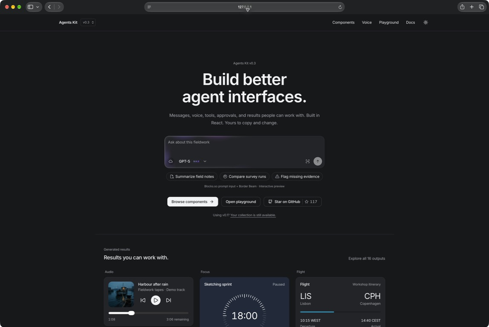
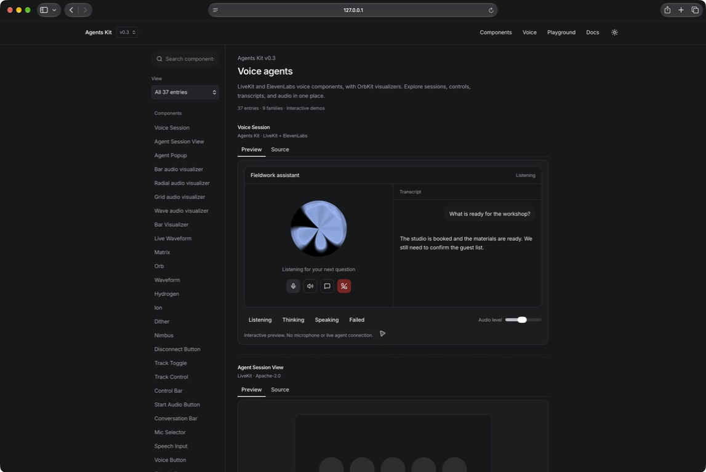
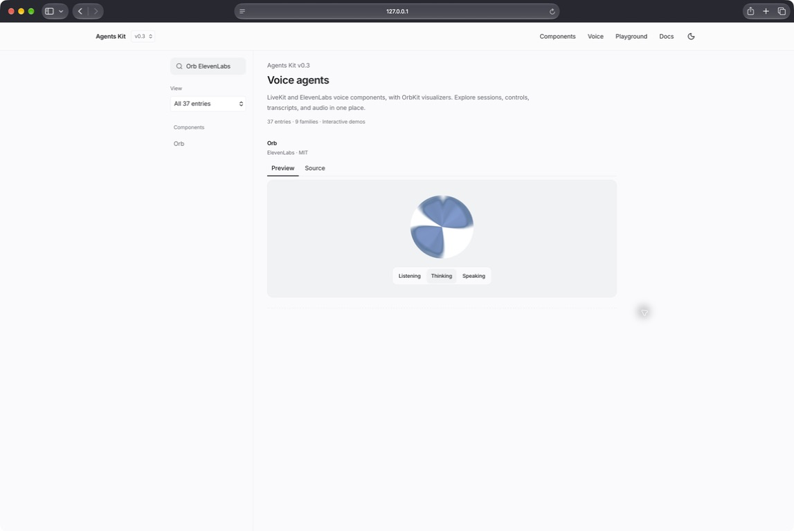
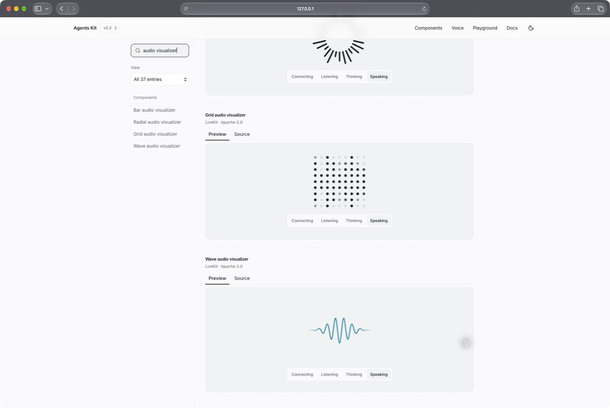
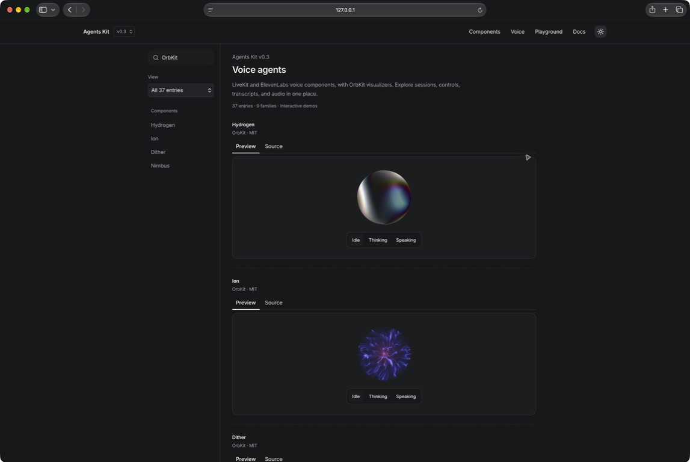

# Agents Kit

[](https://agents-ui.github.io/agents-kit/)

Agents Kit is a copy-source React library for AI agent interfaces. Version 0.3 adds LiveKit and ElevenLabs voice components to the existing messages, tools, approvals, generated results, and workspaces, with one shared design system.

Version 0.3 keeps existing v0.1 and v0.2 component paths and registry slugs available. The previous public source is preserved in the [v0.1.0 tag](https://github.com/agents-ui/agents-kit/tree/v0.1.0).

[Live site](https://agents-ui.github.io/agents-kit/) · [Components](https://agents-ui.github.io/agents-kit/components) · [Voice](https://agents-ui.github.io/agents-kit/voice) · [Playground](https://agents-ui.github.io/agents-kit/generative) · [v0.1 archive](https://agents-ui.github.io/agents-kit/v0.1)

[Installation](https://agents-ui.github.io/agents-kit/docs/installation) · [MCP setup](https://agents-ui.github.io/agents-kit/docs/mcp) · [llms.txt](https://agents-ui.github.io/agents-kit/llms.txt) · [Full LLM reference](https://agents-ui.github.io/agents-kit/llms-full.txt)

## What is new in v0.3

Voice agents need clear listening and speaking states, useful media controls, readable transcripts, and recovery when a session ends. This release combines LiveKit and ElevenLabs components in a dedicated Voice section, with credential-free demos and installable source. Existing generative and conversational collections remain available.

## Explore

- `/components` presents the current component families in one continuous, searchable catalog.
- `/voice` brings together voice visualizers, session controls, transcripts, playback, and voice selection.
- `/generative` shows generated answers and work products in ready, loading, and error states.
- `/v0.1` keeps the previous component gallery available for existing users.
- `/docs` explains installation, integration, provenance, and the v0.2 migration.

## Included collections

| Collection       | Included in v0.3                                                                                                               |
| ---------------- | ------------------------------------------------------------------------------------------------------------------------------ |
| LiveKit voice    | Four audio visualizers, transcript and media controls, session context, and session/popup blocks |
| ElevenLabs voice | All 17 UI families, including Orb, Waveform, Voice Button, Voice Picker, Speech Input, and Transcript Viewer |
| OrbKit | Four MIT shader orbs: Hydrogen, Ion, Dither, and Nimbus, with agent states and audio-volume inputs |
| Beautiful UI     | 21 original public primitives and all documented variants; existing controlled adapters retained                               |
| beUI AI Agents   | 16 public AI agent families, 19 registry entries, and all 28 documented demos                                                  |
| AI Elements      | All 49 public elements, 84 upstream examples, and seven workflow views                                                         |
| Prompt Kit       | All 21 primitives, 52 documented variants, and two local chat compositions                                                     |
| BoardUI AI       | Agent Thinking in four styles, Composer Loader, and the local Chat Starter                                                     |
| Generative UI    | 11 answer shapes and five work-output shapes in one controlled surface system                                                  |
| Thinking Orb     | All nine public canvas states, plus optional pointer-gravity interaction, with size, color, pause, and reduced-motion controls |
| Agent runtime    | Context usage and checkpoint controls informed by public AI Elements patterns                                                  |
| Blocks.so        | All five original AI compositions plus the four existing controlled compositions                                               |
| Optional effects | Border Beam, Gooey, Metal FX v1/v2, and Image FX with their public presets                                                     |

The main catalog groups equivalent implementations into families. For example, related loading, approval, prompt, message, code, and task components appear together as source variants instead of repeated, unrelated entries.

## Design system

All collections share a compact foundation based on Beautiful UI: Inter and JetBrains Mono, consistent spacing, cool neutral surfaces, hairline borders, and explicit chip/control/card/window radii. Component-specific states and interactions remain intact. The [design contract](DESIGN.md) and [installation guide](https://agents-ui.github.io/agents-kit/docs/installation) document the typography, theme, and required CSS pipeline.

## Voice agents

[](https://agents-ui.github.io/agents-kit/voice#voice-agent-session)

Explore the [Voice section](https://agents-ui.github.io/agents-kit/voice) or read the [integration guide](https://agents-ui.github.io/agents-kit/docs/voice-agents). Try listening, thinking, and speaking states, adjust the sample audio level, toggle controls, and inspect each source variant.

The page shows 37 entries individually: 15 LiveKit, 17 ElevenLabs, four OrbKit shaders, and one combined session. OrbKit's non-commercial shader ports are excluded.

<table>
  <tr>
    <td width="50%"><a href="https://agents-ui.github.io/agents-kit/voice#elevenlabs-orb"></a></td>
    <td width="50%"><a href="https://agents-ui.github.io/agents-kit/voice#livekit-agent-audio-visualizer-wave"></a></td>
  </tr>
</table>

The combined `VoiceAgentSession` uses real UI components from both collections. It exposes callbacks for the host application to connect a provider; its gallery preview is simulated. Provider-specific components keep their original APIs and setup requirements. No credentials are embedded in the kit.

[](https://agents-ui.github.io/agents-kit/voice#orbkit-shdr-13)

## Generative UI

[](https://agents-ui.github.io/agents-kit/generative)

Try an inbox, compare two options, review a document, or update a checklist. Expand a result, edit its content, compare versions, save it, or share a link from the playground.

The examples follow Fieldwork, a fictional studio planning a Lisbon–Copenhagen workshop. Names, messages, itineraries, and figures are illustrative. The harbour, studio, and botanical artwork was generated for these demos; screenshots show the actual components.

### A closer look

<table>
  <tr>
    <td width="50%" valign="top">
      <strong>An inbox that brings the work together</strong><br />
      Updates, attachments, unread states, and the next action.<br /><br />
      <a href="https://agents-ui.github.io/agents-kit/generative#generated-inbox"></a>
    </td>
    <td width="50%" valign="top">
      <strong>Collections worth opening</strong><br />
      Images grouped into a compact, editable result.<br /><br />
      <a href="https://agents-ui.github.io/agents-kit/generative#generated-collection"></a>
    </td>
  </tr>
  <tr>
    <td width="50%" valign="top">
      <strong>Recommendations with a next step</strong><br />
      See the context, review alternatives, and make a decision.<br /><br />
      <a href="https://agents-ui.github.io/agents-kit/generative#generated-recommendation"></a>
    </td>
    <td width="50%" valign="top">
      <strong>Checklists you can work through</strong><br />
      Completed steps, remaining work, and clear ownership.<br /><br />
      <a href="https://agents-ui.github.io/agents-kit/generative#generated-checklist"></a>
    </td>
  </tr>
</table>

`AgentGenerativeSurface` renders caller-supplied data for these answer types:

`audio`, `focus`, `flight`, `location`, `weather`, `stories`, `inbox`, `note`, `collection`, `event`, and `activity`.

The generative showcase also includes comparisons, recommendations, documents, checklists, and source briefs. Each result supports inline expansion, editing, original-versus-current comparison, saving in the demo browser, link sharing, and copying. The reusable `ResultActions` component exposes these actions through typed callbacks.

```tsx
import { AgentGenerativeSurface } from "@/components/agents-ui/agent-generative-surface"

export function WeatherAnswer() {
  return (
    <AgentGenerativeSurface
      content={{
        type: "weather",
        location: "Madrid",
        temperature: 24,
        unit: "C",
        condition: "Light rain",
        forecast: [
          { day: "Today", temperature: 24 },
          { day: "Tomorrow", temperature: 25 },
        ],
      }}
    />
  )
}
```

The core components receive data through props and return user intent through callbacks. Optional LiveKit and ElevenLabs integrations use the host application’s provider configuration. The gallery makes no agent calls and requests no microphone access; your application owns credentials, permissions, capture, persistence, and network activity.

## Optional effects

The Effects collection includes Border Beam, Gooey, Metal FX, and Image FX. Add them where motion helps explain a change. Existing components keep their compact defaults.

```tsx
import { BorderBeam } from "@/components/effects/border-beam"

export function WorkingResult({ isWorking }: { isWorking: boolean }) {
  return (
    <BorderBeam active={isWorking} size="line">
      <div className="rounded-xl border p-4">Preparing your brief</div>
    </BorderBeam>
  )
}
```

Thinking Orb also supports 20px, 32px, and 64px sizes, with optional color and dot controls. The default remains monochrome.

## Install and run locally

The repository uses npm, React 19, Next.js 15, and Tailwind CSS 4.

```bash
npm install
npm run dev
```

Open the local URL reported by Next.js. Use `/components` for the current catalog and `/voice` for voice components, `/generative` for the composed generative UI showcase, and `/v0.1` for the compatibility gallery.

Agents Kit follows the shadcn copy-source model. Registry entries include the component, its public local dependencies, required styles, package dependencies, and applicable license files. You own the copied source inside your application and can adapt it to your product.

To add a component to an existing shadcn project:

```bash
npx shadcn@latest add https://agents-ui.github.io/agents-kit/c/agent-generative-surface.json
```

Load the shared styles once in the application entry:

```css
@import "./components/boardui/styles/globals.css";
@import "./styles/agents.css";
```

Adjust these paths relative to your global stylesheet and the installed component directory. The shared stylesheet includes Tailwind; avoid importing it twice. Registry installation copies the CSS files but does not add these imports automatically. See the [installation guide](https://agents-ui.github.io/agents-kit/docs/installation) for setup and aliases.

## Coding assistants

Agents Kit works with the standard shadcn MCP server. Add `"@agents-kit": "https://agents-ui.github.io/agents-kit/c/{name}.json"` to your application's `components.json` registries, then configure the server with `npx -y shadcn@latest mcp` from that application's working directory. Follow the [MCP setup guide](https://agents-ui.github.io/agents-kit/docs/mcp) for client configuration.

The [short LLM guide](https://agents-ui.github.io/agents-kit/llms.txt) indexes the collection. The [full reference](https://agents-ui.github.io/agents-kit/llms-full.txt) includes setup, every registry entry, and TypeScript declarations generated from the shipped source. Both files regenerate during builds.

## Migrating from v0.1

Existing `components/agents-ui/agent-*.tsx` entry paths and their registry slugs remain available. Version 0.2 does not automatically rename or remove those imports. The previous components move out of the main catalog because the new catalog is organized around generative UI families, but existing applications can continue using them.

New work should start with the current families and compose application-specific behavior around their controlled props and callbacks. See [Migrating to v0.2](docs/migrating-to-v0.2.md) for the compatibility contract and an incremental adoption path.

## Development

```bash
npm test
npm run typecheck
npm run build:registry
npm run build
npm run verify:distribution
```

Examples run locally without connecting to a model or backend.

## Provenance and licensing

Agents Kit preserves attribution and license notices with copied or adapted source.

- [LiveKit](https://github.com/livekit/components-js), Apache-2.0 with file-level MIT notices, supplies the voice session and media components. Its separately licensed Aura shader is excluded.
- [ElevenLabs UI](https://github.com/elevenlabs/ui), MIT licensed, supplies the 17 voice UI families.
- [OrbKit](https://github.com/zzzzshawn/orbkit) supplies four MIT shader orbs and their shared WebGL renderer. Non-commercial ports are excluded.
- [Beautiful UI](https://github.com/slev12397/beautiful-ui), MIT licensed, is the source for the 21 Beautiful UI families.
- [beUI](https://github.com/starc007/ui-components), MIT licensed, is the source for the public AI agent component collection.
- [Libraries.dev](https://github.com/Jakubantalik/Libraries.dev), MIT licensed, supplies Thinking Orbs, Border Beam, Gooey, Metal FX, and Image FX.
- [Vercel AI Elements](https://github.com/vercel/ai-elements), Apache-2.0 licensed, supplies the complete AI Elements collection and informed the earlier context and checkpoint controls.
- [Blocks.so](https://github.com/ephraimduncan/blocks), MIT licensed, supplies five original AI compositions and four adapted compositions.
- [BoardUI](https://github.com/BoardUI/boardui), MIT licensed, supplies the underlying controls, theme, and free AI chat components.
- [Prompt Kit](https://github.com/ibelick/prompt-kit) supplies all 21 conversational primitives and their documented examples.

The [source coverage report](docs/source-coverage.md) records the catalog sweep, documented variants, and remote demo-media exceptions.

Pinned revisions, source relationships, and notices are recorded in [THIRD_PARTY_NOTICES.md](THIRD_PARTY_NOTICES.md) and in source metadata beside each adapted collection. The Agents Kit project license remains in [LICENSE.md](LICENSE.md). Upstream source keeps its original license.

## Release status

v0.3.0 adds the LiveKit and ElevenLabs voice collection, published on 2026-09-13. The library is distributed as copyable source and registry entries. See [CHANGELOG.md](CHANGELOG.md) for release details and [Migrating to v0.2](docs/migrating-to-v0.2.md) for the compatibility path.

## Author

Abhishek Gahlot, [me@abhishek.it](mailto:me@abhishek.it)

I’m also working on [useAgent](https://github.com/useagenthq/useagent), an open-source workspace for agents that work with your tools and return finished files. Follow the project at [useagenthq/useagent](https://github.com/useagenthq/useagent).
